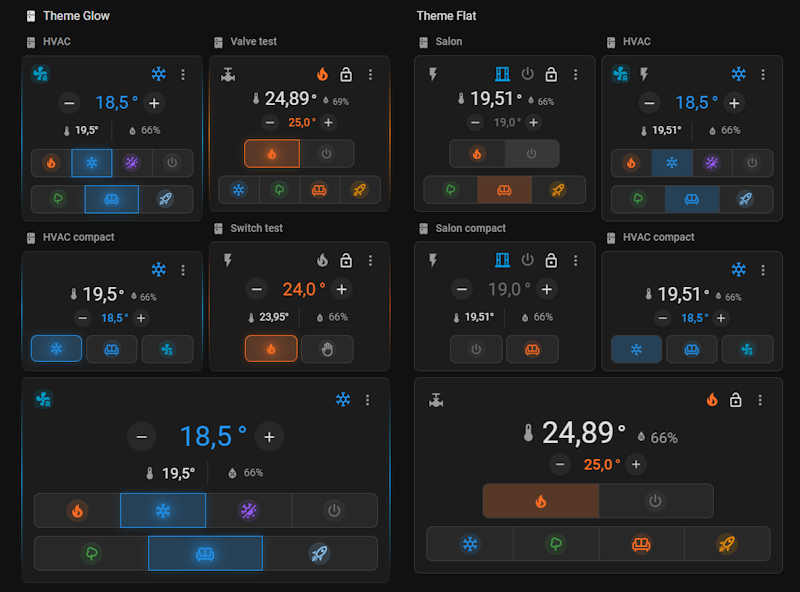
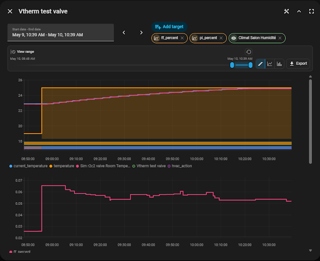

# Equinox

Equinox is a custom Lovelace card for Home Assistant. It is designed for
Versatile Thermostat while keeping compatibility with standard `climate`
entities.

The project uses Lit, strict TypeScript, and Vite library mode. The Lovelace
card is registered as:

```yaml
type: custom:equinox-card
```

If Equinox is useful in your Home Assistant setup, you can support development
on [Buy Me a Coffee](https://buymeacoffee.com/kipk).



## History Viewer

Equinox embeds
[`@kipk/ha-better-history`](https://www.npmjs.com/package/@kipk/ha-better-history),
a standalone Home Assistant history web component also available on
[GitHub](https://github.com/KipK/ha-better-history). It powers the history
dialog with multi-series charts, no-refetch view zoom, display modes, entity and
attribute series support, and portable JSON export/import.



## Installation

Equinox requires Home Assistant 2026.5 or newer.

### Via HACS

[](https://my.home-assistant.io/redirect/hacs_repository/?owner=KipK&repository=equinox&category=Plugin)


1. Add this repository as a custom repository in HACS (type: **Dashboard**).
2. Install **equinox** from HACS.
3. Clear browser cache and reload Home Assistant.

### Manual

1. Download `equinox-card.js` from the latest release.
2. Copy it to `www/community/equinox/`.
3. Add it as a Lovelace resource:

```yaml
url: /local/community/equinox/equinox-card.js
type: module
```


## Build

Install dependencies:

```bash
npm install
```

`@kipk/ha-better-history` is installed from npm and bundled into
`equinox-card.js`. Equinox registers its embedded history component as
`<equinox-better-history>` so local development can run alongside other cards
that bundle different `ha-better-history` builds.

Build the distributable card:

```bash
npm run build
```

The generated Lovelace resource is a single file with everything bundled in:

```text
dist/equinox-card.js
dist/equinox-card.js.gz
```

Translations, attribute units, and built-in Regulation dashboards are compiled
directly into the JavaScript bundle — no external JSON files are needed at
runtime. The `.gz` file is a precompressed copy for Home Assistant deployments
that serve it when the browser advertises gzip support.

Vite 8 requires Node `^20.19.0 || >=22.12.0`.

## Home Assistant Resource

After building, expose `dist/equinox-card.js` to Home Assistant, then add it as
a Lovelace resource:

```yaml
url: /local/equinox-card.js
type: module
```

The exact `/local/` path depends on where the built file is copied in the Home
Assistant `www/` directory.

## Example

```yaml
type: custom:equinox-card
entity: climate.salon
name: Salon
power_entity: sensor.salon_puissance
humidity_entity: sensor.salon_humidity
theme: liquid_glow
display_mode: classic
primary_display: setpoint
card_background_color: "#20242a"
card_background_opacity: 92
disable_name: false
enable_lock: true
additional_dashboards: auto
```

## Configuration

| Option                  | Required | Default              | Description                                                    |
| ----------------------- | -------- | -------------------- | -------------------------------------------------------------- |
| `entity`                | yes      | -                    | Climate entity to display. Must use the `climate` domain.      |
| `name`                  | no       | Entity friendly name | Display name; hidden in the editor when `display_mode: thin`.  |
| `power_entity`          | no       | -                    | Sensor or input number for instant power.                      |
| `humidity_entity`       | no       | -                    | External humidity sensor when climate humidity is unavailable. |
| `theme`                 | no       | `liquid_glow`        | Visual theme: `flat` or `liquid_glow`.                         |
| `display_mode`          | no       | `classic`            | Display format: `classic`, `compact`, or `thin`.               |
| `primary_display`       | no       | `setpoint`           | Main emphasis: `setpoint` or `sensors`; ignored in `thin`.     |
| `use_temperature_popup` | no       | `true`               | Use the slider popup setpoint selector in `classic`/`compact`; set to `false` to keep the inline +/- selector. `thin` always uses it. |
| `card_background_color` | no       | HA card background   | CSS color for the card background, editable with the visual editor color picker. HVAC and preset selectors follow this surface. |
| `card_background_opacity` | no     | `100`                | Card background opacity from `0` to `100`; lower values make the card more transparent. |
| `disable_name`          | no       | `false`              | Hide the header name; hidden in the editor when `display_mode: thin`. |
| `enable_lock`           | no       | `true`               | Enable lock UI when supported by VT.                           |
| `additional_dashboards` | no       | `auto`               | Regulation dashboard mode: `auto`, `custom`, or `disabled`.    |
| `state_icons_layout`    | no       | `horizontal`         | State icon layout for `classic`/`compact`: `horizontal` or `vertical`; `thin` is always horizontal. |

Regulation diagnostics are discovered automatically from the climate entity
attribute `specific_states.regulation_diagnostics` when the thermostat
algorithm publishes it.

## Regulation Dashboard

Equinox can show a **Regulation** entry in the card menu. It opens a dedicated
dashboard for the thermostat regulation algorithm with compact sections, values,
statuses, progress bars, history graphs, and optional confirmed actions.

The `additional_dashboards` option controls this feature:

| Value | Behavior |
| ----- | -------- |
| `auto` | Detects the regulation algorithm from the climate entity and loads the matching built-in dashboard. If no dashboard exists for the detected algorithm, the Regulation menu entry is hidden. |
| `custom` | Always shows the Regulation menu entry and loads `/local/equinox/dash/custom.js`. If the file is missing or invalid, the dialog shows a short error. |
| `disabled` | Hides Regulation completely. |

Built-in dashboards currently include Smart PI and Hysteresis. Desktop uses a
side section menu inside the dialog; mobile opens a single section directly or
shows multi-section dashboards from the Equinox menu first.

For custom dashboards, JSON schema details, available block types, sources,
conditions, history graph options, and actions, see
[Regulation Dashboard](docs/regulation-dashboard.md).

## Dashboard sizing

Equinox declares Home Assistant dashboard sizing hints for both masonry and
sections views. In sections view, the default grid height is automatic so the
card follows its rendered content instead of forcing a fixed row count.

## Development Notes

- User-visible text must go through `src/localize/languages/{lang}.json` (19
  languages). The English file (`en.json`) is the reference; other languages
  fall back to it for missing keys.
- The card must remain compatible with a standard Home Assistant `climate`
  entity.
- VT-specific features are displayed only when the required data or capability
  is available.
  
## Adding a language

1. Add `src/localize/languages/{code}.json` using `en.json` as a template.
2. Add the import and export entry in `src/localize/languages/index.ts`.
3. Add the language code to `SUPPORTED_LANGUAGES` in
   `src/localize/loader.ts`.
4. Add the `card.description` string to the `CARD_DESCRIPTIONS` map in
   `src/equinox-card.ts`.
5. Run `npm run build` — the new language file compiles into the single JS
   bundle automatically.
